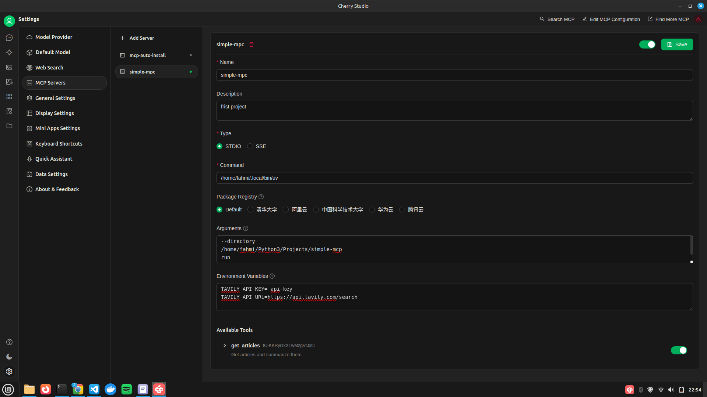

# Simple MCP with Tavily + Cherry Studio

A minimal implementation of **MCP (Model Context Protocol)** using:

- [Tavily](https://docs.tavily.com/documentation/api-reference/endpoint/search) for web search.
- [Cherry Studio](https://docs.cherry-ai.com/cherrystudio/download) as the MCP client.
- API Key (OpenAI, Groq, Gemini, etc)

---

### Requirements

- Python 3.11
- [uv](https://github.com/astral-sh/uv)

---

### Features

- Tavily-powered web search tool.
- Fully compatible with Cherry Studio via MCP.

---

### Getting Started

#### 1. Clone the Repository

```bash
git clone https://github.com/your-username/simple-mcp.git
cd simple-mcp
```

#### 2. Install `uv`

```bash
curl -Ls https://astral.sh/uv/install.sh | bash
```

Make sure `~/.local/bin` is in your `PATH`:

```bash
export PATH="$HOME/.local/bin:$PATH"
```

#### 3. Setup Environment

```bash
uv venv
source .venv/bin/activate
uv pip install -e .
```

---

### Cherry Studio Setup (MCP Integration)

1. Open Cherry Studio  
2. Go to **Settings → MCP Servers → Add Server**  
3. Configure as follows:

- **Name**: `simple-mpc`  
- **Description**: `first project`  
- **Type**: `STDIO`  
- **Command**:
  ```
  /home/your-username/.local/bin/uv   # <- path UV
  ```
- **Arguments**:
  ```
  --directory
  /home/your-username/Projects/simple-mcp
  run
  get_stock_price.py
  ```
- **Environment Variables**:
  ```
  TAVILY_API_KEY=your-tavily-api-key
  TAVILY_API_URL=https://api.tavily.com/search
  ```

4. Click **Save**  
5. Activate the MCP toggle

**Note:** Replace `/home/your-username/...` with your actual project path.

Example configuration:



---

### Download Cherry Studio

- **Windows**: [Download EXE](https://github.com/CherryHQ/cherry-studio/releases/download/v1.1.17/Cherry-Studio-1.1.17-setup.exe)  
- **macOS**: [Download DMG](https://github.com/CherryHQ/cherry-studio/releases/download/v1.1.17/Cherry-Studio-1.1.17-x64.dmg)  
- **Linux**: [Download AppImage](https://github.com/CherryHQ/cherry-studio/releases/download/v1.1.17/Cherry-Studio-1.1.17-x86_64.AppImage)

#### For Linux Users

```bash
chmod +x Cherry-Studio-1.1.17-x86_64.AppImage
./Cherry-Studio-1.1.17-x86_64.AppImage
```
please follow the tutorial below, you only need to change the name of the application with Cherry-Studio...AppImage
- [Cursor AI: From Installation to Mastery on Linux 2025 (Tutorial)](https://dev.to/mesonu/how-to-install-cursor-ai-editor-on-linux-ubuntu-2025-update-3kji)
  
  Note: Download image cherry.png (search on google) and move using following cmd
  ```bash
  sudo mv cherry.png /opt/cherry.png
  ```

---

### Available Tool

- **get_articles**  
- **get_stock_price**
- **get_stock_price_history**
- **compare_stocks**

---

### Resources

- [Tavily API Docs](https://docs.tavily.com/documentation/api-reference/endpoint/search)
- [Cherry Studio Docs](https://docs.cherry-ai.com/cherrystudio/download)
- [MCP Setup Guide](https://docs.cherry-ai.com/advanced-basic/mcp)

---